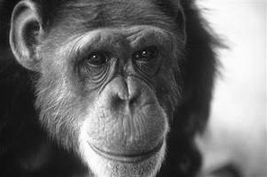
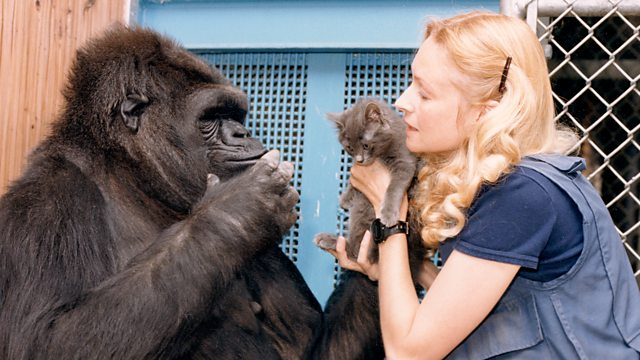

```{r, include=FALSE}
knitr::opts_chunk$set(echo = FALSE, warning = FALSE, message = FALSE, dev='cairo_pdf',
                      out.width="100%", fig.show='hold', fig.align='center')
library(tidyverse)
theme_set(theme_minimal()+theme(legend.position = "bottom", text = element_text(size = 26)))
```

## Мифы о жестовых языках

>- Жестовых языков много. На [spreadthesign.com](spreadthesign.com) есть словарь и разговорники для более 30 языков.

```{r, eval=FALSE}
library(lingtypology)
glottolog %>% 
  filter(str_detect(language, "Sign")) %>% 
  select(language, latitude, longitude) %>% 
  na.omit() ->
  sl
map.feature(sl$language, latitude = sl$latitude, longitude = sl$longitude, width = 4)  
```

```{r, fig.cap="241 ЖЯ из базы данных Glottolog (Hammarström, Forkel 2022)"}
knitr::include_graphics("images/01_map.png")
```

\nocite{glottolog22}

## Мифы о жестовых языках

>- ЖЯ состоят не только из пальцевого алфавита.
>- ЖЯ не являются пантомимой.
>- ЖЯ --- отдельные языки, а не дублет для передачи звучащего языка.
>- ЖЯ --- естественные языки, которые возникают, когда глухие оказываются вместе.
>- У носителей ЖЯ присутствует та же ассимитрия между полушариями, что и в случае звучащих языков [@campbell08].
>- Зоны мозга, которые отвечают за производство и понимание речей на ЖЯ, соотносятся с аналогичными зонами у носителей звучащих языков [@campbell08].
>- При естественном усвоении ЖЯ ребенок проходит те же стадии, что и дети, усваивающие звучащий язык [@conlin00].
>- Глухой --- не значит немой. Не все глухие читают по губам.

## Структура ЖЯ

Лингвистическое исследование ЖЯ началось с работ [@stokoe60; @stokoe65]. Сейчас считается, что ЖЯ состоит из обычных для всех языково уровней

- фонологический
    - форма кисти руки
    - ориентация кисти
    - локализацию
    - движение
    - немануальный компонент
- морфологический
    - образование множественного числа
    - согласующиеся глаголы
- синтаксический
- лексический

## Особенности ЖЯ

- мало морфологии
- иконичность знаков
- дактильная азбука
- заимствования из звучащих языков
- наличие фонетики
- слабое различие между частями речи
- много грамматической редупликации (повторение)
- возможная нелинейность жестов

## Зачем исследовать и изучать ЖЯ?

- расширение лингвистической теории
- задачи обработки естественного языка (NLP)
- расширение знаний о когнитивных способностях человека и других приматов

```{r, fig.cap="Уошо [Gardner, Gardner 1985] и Коко [Patterson, Linden 1981]", out.width="49%"}


```

\nocite{gardner85}
\nocite{patterson81}

## {}

\LARGE Спасибо за внимание!

# Литература {.allowframebreaks}
